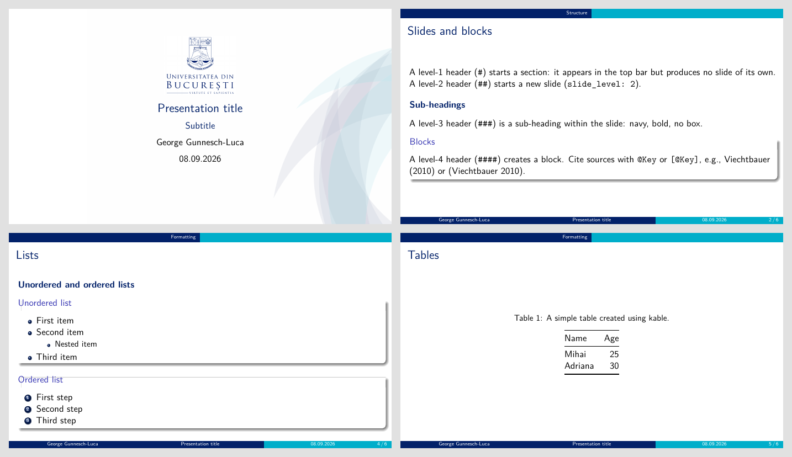

# University of Bucharest Beamer template (using R Markdown)

This repo contains my version of a Beamer template using the University of Bucharest colours, driven by R Markdown / pandoc. It is based on the CambridgeUS default and modified to match the official guidelines.



## Files in the repo

- `index.Rmd`. The template containing YAML header plus example slides that document the conventions. Just delete the examples and write your own content.
- `includes/presentation_setup.tex`. This contais the colours, title page, logo, background, and the `\subheading{}` macro.
- `includes/headings.lua`. The pandoc filter where I modified the level-3 headers to become sub-headings. Level-4 headers become blocks.
- `includes/logo.png`. The UB Logo (only on the title page).
- `includes/background.png`.  Some title-page artwork I found on the official ,PPT file. 
- `referinte.bib`. The bibliography file (BibTeX).

## Rendering

Requires R with `rmarkdown` and a XeLaTeX installation (e.g. `tinytex::install_tinytex()`).

``` r
rmarkdown::render("index.Rmd")
```

Or from the RStudio Knit button. Handout mode: uncomment `classoption: handout` in the YAML.

## Writing slides

- `# Title` — section (no section slide is produced; `\AtBeginSection{}` is empty).
- `## Title` — new slide (`slide_level: 2`).
- `### Title` — sub-heading inside a slide (navy bold, no box).
- `#### Title` — block inside a slide.
- `## Title {.allowframebreaks}` — let a long slide (e.g. the bibliography) break across frames.
- Citations: `@Key` or `[@Key]` with keys from `referinte.bib` (one example entry, `Viechtbauer2010`); the list is printed on the last slide, `## References {.allowframebreaks}`.
- Tables: `knitr::kable()` / `kableExtra` in an R chunk with `echo=FALSE`.

## Colours

- `bluep` — RGB(2, 33, 105), UB navy (titles, items, TOC, bibliography).
- `tealp` — RGB(0, 174, 202), teal (primary palette / footer).
